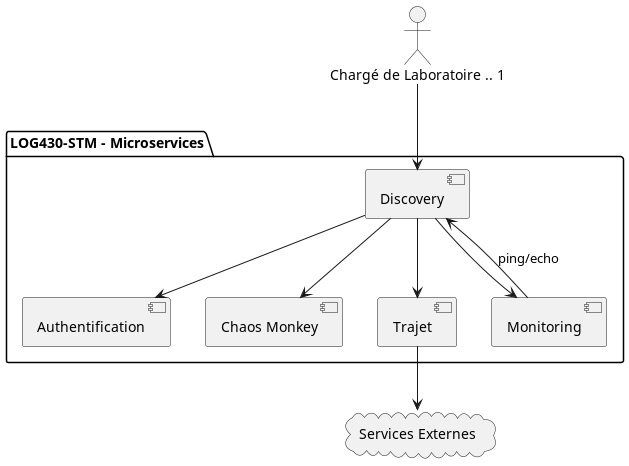
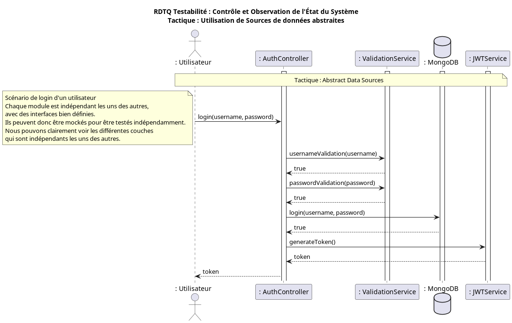
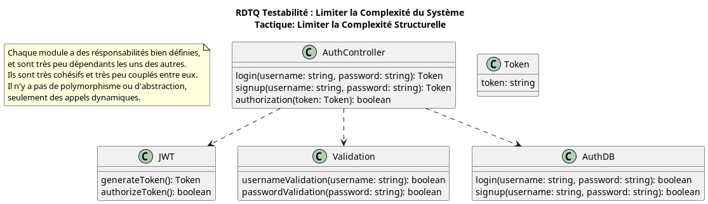

# Documentation de l'architecture du laboratoire de LOG430
- [Documentation de l'architecture du laboratoire de LOG430](#documentation-de-larchitecture-du-laboratoire-de-log430)
- [Page titre](#page-titre)
- [Introduction](#introduction)
- [Scénario d'objectif d'affaire](#scénario-dobjectif-daffaire)
  - [OA-1. Faciliter le recrutement des nouveaux chargés de laboratoire.](#oa-1-faciliter-le-recrutement-des-nouveaux-chargés-de-laboratoire)
  - [OA-2. Validez si le transport par autobus est toujours plus rapide, peu importe l'heure de la journée](#oa-2-validez-si-le-transport-par-autobus-est-toujours-plus-rapide-peu-importe-lheure-de-la-journée)
- [Cas d'utilisations](#cas-dutilisations)
    - [**CU01** - Veux comparer les temps de trajet.](#cu01---veux-comparer-les-temps-de-trajet)
    - [**CU02** - Veux pouvoir mettre le chaos dans les microservices.](#cu02---veux-pouvoir-mettre-le-chaos-dans-les-microservices)
    - [**CU03** - Vous devez proposer un nouveau cas d'utilisation](#cu03---vous-devez-proposer-un-nouveau-cas-dutilisation)
    - [**CU04** - Veux pouvoir s'authentifier ](#cu04---veux-pouvoir-s'authentifier)
    - [**CU05** - vous devez proposer un nouveau cas d'utilisation](#cu05---vous-devez-proposer-un-nouveau-cas-dutilisation)
    - [**CU06** - vous devez proposer un nouveau cas d'utilisation](#cu06---vous-devez-proposer-un-nouveau-cas-dutilisation)
    - [**CU07** - vous devez proposer un nouveau cas d'utilisation](#cu07---vous-devez-proposer-un-nouveau-cas-dutilisation)
    - [**CU08** - vous devez proposer un nouveau cas d'utilisation](#cu08---vous-devez-proposer-un-nouveau-cas-dutilisation)
    - [**CU09** - vous devez proposer un nouveau cas d'utilisation](#cu09---vous-devez-proposer-un-nouveau-cas-dutilisation)
    - [**CU10** - vous devez proposer un nouveau cas d'utilisation.](#cu10---vous-devez-proposer-un-nouveau-cas-dutilisation)
- [Vue architecturale de contexte](#vue-architecturale-de-contexte)
  - [Présentation primaire](#présentation-primaire)
  - [Catalogue d'éléments](#catalogue-déléments)
  - [<s>Diagramme de contexte</s> Pas nécessaire puisque c'est déja un vue de contexte](#sdiagramme-de-contextes-pas-nécessaire-puisque-cest-déja-un-vue-de-contexte)
  - [Guide de variabilité](#guide-de-variabilité)
  - [Raisonnement](#raisonnement)
  - [<s>Vues associées</s> pas nécessaire puisque c'est la première vue que vous réalisé pour votre système.](#svues-associéess-pas-nécessaire-puisque-cest-la-première-vue-que-vous-réalisé-pour-votre-système)
- [Conception axée sur les attributs de qualité](#conception-axée-sur-les-attributs-de-qualité)
  - [ADD-Disponibilité](#add-disponibilité)
    - [ADD-détection de faute](#add-détection-de-faute)
    - [ADD-Préparation et réparation](#add-préparation-et-réparation)
    - [ADD-Réintroduction](#add-réintroduction)
    - [ADD-Prévention des fautes](#add-prévention-des-fautes)
  - [ADD-Modifiabilité](#add-modifiabilité)
    - [ADD-Réduire la taille des modules](#add-réduire-la-taille-des-modules)
    - [ADD-Augmenter la cohésion](#add-augmenter-la-cohésion)
    - [ADD-Réduire le couplage](#add-réduire-le-couplage)
    - [ADD-Defer binding](#add-defer-binding)
  - [ADD-Performance](#add-performance)
    - [ADD-Contrôler la demande en ressources](#add-contrôler-la-demande-en-ressources)
  - [ADD-Sécurité](#add-sécurité)
    - [ADD-Détecter les attaques](#add-détecter-les-attaques)
    - [ADD-Résister aux attaques](#add-résister-aux-attaques)
    - [ADD-Réagir aux attaques](#add-réagir-aux-attaques)
    - [ADD-Récupérer d'une attaque](#add-récupérer-dune-attaque)
  - [ADD-Testabilité](#add-testabilité)
    - [ADD-Controle and observe l'état du système](#add-controle-and-observe-létat-du-système)
    - [ADD-Limiter la complexité](#add-limiter-la-complexité)
  - [ADD-Usabilité](#add-usabilité)
    - [ADD-Supporter l'initiative de l'usager](#add-supporter-linitiative-de-lusager)
    - [ADD-Supporter l'initiative du système](#add-supporter-linitiative-du-système)
  - [ADD-Interopérabilité](#add-interopérabilité)
    - [ADD-Localiser](#add-localiser)
    - [ADD-Gérer les interfaces](#add-gérer-les-interfaces)
- [Réalisation des cas d'utilisation](#réalisation-des-cas-dutilisation)
    - [**RDCU-CU01** - Veux comparer les temps de trajet.](#rdcu-cu1--)
   
    - [**RDCU-CU02** - Veux pouvoir mettre le chaos dans les services en mode.](#rdcu-cu02---veux-pouvoir-mettre-le-chaos-dans-les-services-en-mode)
    - [**RDCU-CU03**](#rdcu-cu03)
    - [**RDCU-CU04** -](#rdcu-cu04--)
    - [**RDCU-CU05** -Avoir une intercommunication entre microservices à l’aide d’une source unique de découverte de route](#rdcu-cu05--)
    - [**RDCU-CU06** -Veux informer le mainteneur sur le status de vie des microservices](#rdcu-cu06--)
    - [**RDCU-CU07** -Veux pouvoir informer le mainteneur sur l’état interne d’un service (exemple l’état du CPU)](#rdcu-cu07--)
    - [**RDCU-CU08** -Veux avoir le temps d’un trajet en autobus](#rdcu-cu08--)
    - [**RDCU-CU09** -Veux avoir le temps de trajet en auto](#rdcu-cu09--)
    - [**RDCU-CU10** -](#rdcu-cu10--)
- [Réalisation des attributs de qualité](#réalisation-des-attributs-de-qualité)
  - [RDAQ-Disponibilité](#rdaq-disponibilité)
    - [RDTQ-Détection de faute](#rdtq-détection-de-faute)
    - [RDTQ-Préparation et réparation](#rdtq-préparation-et-réparation)
    - [RDTQ-Réintroduction](#rdtq-réintroduction)
    - [RDTQ-Prévention des fautes](#rdtq-prévention-des-fautes)
    - [Relation entre les éléments architectuale et les exigences de disponibilité](#relation-entre-les-éléments-architectuale-et-les-exigences-de-disponibilité)
  - [RDAQ-Modifiabilité](#rdaq-modifiabilité)
    - [RDTQ-Réduire la taille des modules](#rdtq-réduire-la-taille-des-modules)
    - [RDTQ-Augmenter la cohésion](#rdtq-augmenter-la-cohésion)
    - [RDTQ-Réduire le couplage](#rdtq-réduire-le-couplage)
    - [RDTQ-Defer binding](#rdtq-defer-binding)
    - [Relation entre les éléments architectuale et les exigences de disponibilité](#relation-entre-les-éléments-architectuale-et-les-exigences-de-disponibilité-1)
  - [RDAQ-Performance](#rdaq-performance)
    - [RDTQ-Contrôler la demande en ressources](#rdtq-contrôler-la-demande-en-ressources)
    - [RDTQ-Gérer les ressources](#rdtq-gérer-les-ressources)
  - [RDAQ-Sécurité](#rdaq-sécurité)
    - [RDTQ-Détecter les attaques](#rdtq-détecter-les-attaques)
    - [RDTQ-Résister aux attaques](#rdtq-résister-aux-attaques)
    - [RDTQ-Réagir aux attaques](#rdtq-réagir-aux-attaques)
    - [RDTQ-Récupérer d'une attaque](#rdtq-récupérer-dune-attaque)
    - [Relation entre les éléments architectuale et les exigences de sécurité](#relation-entre-les-éléments-architectuale-et-les-exigences-de-sécurité)
  - [RDAQ-Testabilité](#rdaq-testabilité)
    - [RDTQ-Contrôle et observe l'état du système](#rdtq-contrôle-et-observe-létat-du-système)
    - [RDTQ-limiter la complexité](#rdtq-limiter-la-complexité)
    - [Relation entre les éléments architectuale et les exigences de testabilité](#relation-entre-les-éléments-architectuale-et-les-exigences-de-testabilité)
  - [RDAQ-Usabilité](#rdaq-usabilité)
    - [RDTQ-Supporter l'initiative de l'usager](#rdtq-supporter-linitiative-de-lusager)
    - [RDTQ-Supporter l'initiative du système](#rdtq-supporter-linitiative-du-système)
    - [Relation entre les éléments architectuale et les exigences d'usabilité](#relation-entre-les-éléments-architectuale-et-les-exigences-dusabilité)
  - [RDAQ-Interopérabilité](#rdaq-interopérabilité)
    - [RDTQ-Localiser](#rdtq-localiser)
    - [RDTQ-Gérer les interfaces](#rdtq-gérer-les-interfaces)
    - [Relation entre les éléments architectuale et les exigences d'interopérabilité](#relation-entre-les-éléments-architectuale-et-les-exigences-dinteropérabilité)
- [Vues architecturales](#vues-architecturales)
  - [Vues architecturales de type Module](#vues-architecturales-de-type-module)
    - [Vue #1](#vue-1)
    - [Vue #2...](#vue-2)
  - [Vues architecturales de type composant et connecteur](#vues-architecturales-de-type-composant-et-connecteur)
    - [Vue #1](#vue-1-1)
    - [Vue #2...](#vue-2-1)
  - [Vues architecturales de type allocation](#vues-architecturales-de-type-allocation)
    - [Vue #1](#vue-1-2)
    - [Vue #2 ...](#vue-2-)
- [Conclusion](#conclusion)
- [Documentation des interfaces](#documentation-des-interfaces)
# Page titre

# Introduction
>TODO: insérer votre introduction

# Scénario d'objectif d'affaire
## OA-1. Faciliter le recrutement des nouveaux chargés de laboratoire.
Notre architecture permet la réalisation du scénario qui a pour objectif de faciliter le recrutement de nouveaux chargés grâce à nos choix concernant l'usabilité. Nous avons choisi de séparer notre architecture en petits modules pour tous nos cas d'utilisation, ce qui rends la correction plus facile pour le chargé de laboratoire et lui permet de passer moins de temps à comprendre notre système. Nous croyons aussi que les diagrammes que nous avons réalisés pour chaque vue contribuent à faciliter la compréhension de nos choix d'architecture. Nous pensons que d'autres éléments faciliteraient le recrutement de nouveaux chargés de laboratoire. Notamment, la division du laboratoire en plusieurs étapes de réalisation. Cela éviterait que toutes les équipes ne demandent une correction complète durant les deux mêmes périodes. De plus, l'obligation d'intégrer le service d'autres équipes peut-être difficile à corriger si certaines équipes n'ont pas terminé leur laboratoire, nous croyons donc que d'offrir une alternative lorsque ce scénario se présente serait bénéfique pour recruter d'autres chargés.

## OA-2. Validez si le transport par autobus est toujours plus rapide, peu importe l'heure de la journée
Bien que notre équipe n'ai pas eu comme tâche de réaliser la comparaison des trajets, nous croyons que notre intégration de ce microservice facilite la réalisation de cet objectif d'affaire. En effet, les décisions que nous avons prises an réalisant nos microservices ont le potentiel de permettre au système d'être facilement modifié et de modifier l'itneraction avec d'autres services. Bien que cette fonction ne soit pas implémentée, nos choix architecturaux concernant la modifiabilité, soit de réduire le couplage et d'augmenter la cohésion, permettraient facilement d'ajouter des fonctions et donc, d'ajouter les éléments nécessaires à cet objectif d'affaire. 

# Cas d'utilisations
### **CU01** - Veux comparer les temps de trajet.

**Acteurs externe:** 
- **Chargé de laboratoire:** Veut pouvoir faire la correction de chaque cas d'utilisation.

**Précondition:** 
- Tous les microservices sont opérationnels

**Évènement déclencheur:** 
- La documentation pour ce cas d'utilisation est terminé et l'équipe demande au chargé de laboratoire de corriger celle-ci. 
- L'intégration est complété et l'équipe demande au chargé de laboratoire de corriger celle-ci
- L'implémentation est complété est l'équipe demande au chargé de laboratoire de corriger celle-ci.

**Scénario**
    
1. Le (chargé de laboratoire) CL sélectionne une intersection de départ et une intersection d'arrivée, ainsi que le taux de rafraichissement de la prise de mesure.
2. Le CL sélectionne le [service externe](service-externe.md) qu'il veut utiliser pour faire la comparaison des temps de trajet avec les donnés temps réel de la STM.
3. Le système affiche un graphique du temps de déplacement et met celui-ci à jour selon le taux de rafraichissement.

**Évènement résultant:**
- Le système affiche un graphique des comparatifs de temps de déplacement qui se met à jours selon le taux de rafraichissement.

**Postcondition:**  
- Le système est en attente d'une nouvelle commande de l'utilisateur

**Cas alternatifs:**

1. a  **Service externe:** Utiliser plusieurs [services externes](service-externe.md) disponibles pour faire le comparatif.

**Attributs de qualité**
Documenter l'ensemble des attributs de qualité qui s'appliquent à ce scénario en terme d'objectif et de mesure.    
##### CU01-D1 [**Disponibilité**](#add-disponibilité)
 Définir l'exigence que qualité associé à ce scénario ou N/a
#### CU01-M1 [**Modifiabilité**](#add-modifiabilité)
Définir l'exigence que qualité associé à ce scénario ou N/a
#### CU01-P1 [**Performance**](#add-performance)
Définir l'exigence que qualité associé à ce scénario ou N/a
#### CU01-S1 [**Sécurité**](#add-sécurité)
Définir l'exigence que qualité associé à ce scénario ou N/a
#### CU01-T1 [**Testabilité**](#add-testabilité)
Définir l'exigence que qualité associé à ce scénario ou N/a
#### CU01-U1 [**Usabilité**](#add-testabilité)
Définir l'exigence que qualité associé à ce scénario ou N/a
#### CU01-I1 [**Interopérabilité**](#add-interopérabilité)
Définir l'exigence que qualité associé à ce scénario ou N/a

**Commentaires:**

- Quel sont vos remarques/commentaires par rapport à ce scénario

### **CU02** - Veux pouvoir mettre le chaos dans les microservices.

**Acteurs externe:** 
- Chargé de laboratoire: Veut pouvoir faire la correction de chaque cas d'utilisation.

**Précondition:** 
- Tous les microservices sont opérationnels

**Évènement déclencheur:** 
- La documentation pour cet attribut est terminé et l'équipe demande au chargé de laboratoire de corriger celle-ci. 
- L'intégration est complété et l'équipe demande au chargé de laboratoire de corriger celle-ci
- L'implémentation est complété est l'équipe demande au chargé de laboratoire de corriger celle-ci.

**Scénario**
  1. Un mécanisme automatique et aléatoire de perturbation vient modifier l'architecture de votre système et vous devez vous assurer de quand même respecter les exigences client en terme d'attribut de qualité et de fonctionnalité.
    
**Évènement résultant:**
- L'architecture de votre système est perturbé par le mécanisme.
- Le système conserve un log des perturbations
- Le système conserve un log de comment le système a réagit pour résoudre le problème.

**Postcondition:**  
- Les mécanismes de traitement des attributs de qualité détectent le problème et modifie automatiquement l'architecture de votre système pour qu'il continue à respecter les exigences client.

**Cas alternatifs:**
- 1.a La perturbation consiste à détruire un microservice
- 1.b La perturbation consiste à augmenter la latence d'un microservice

**Attributs de qualité**

Documenter l'ensemble des attributs de qualité qui s'appliquent à ce scénario en terme d'objectif et de mesure.    

#### CU02-D1 [**Disponibilité**](#add-disponibilité) 
*Prévention de fautes*
- Augmenter les compétences

#### CU02-M1 [**Modifiabilité**](#add-modifiabilité)
N/A
#### CU02-P1 [**Performance**](#add-performance) 
N/A
#### CU02-S1 [**Sécurité**](#add-sécurité)
N/A
#### CU02-T1 [**Testabilité**](#add-testabilité) 
N/A
#### CU02-U1 [**Usabilité**](#add-usabilité)
*Supporter l'initiative de l'usager*
- "Aggregate"

*Supporter l'initiative du système*
- Maintenir le modèle de tâches
#### CU02-I1 [**Interopérabilité**](#add-interopérabilité)
*Gérer les interfaces*
- "Tailor interface"

*Localiser*
- Découvrir le service

### **CU03** - Vous devez proposer un nouveau cas d'utilisation

**Acteurs externe:** 

**Précondition:** 

**Évènement déclencheur:** 

**Scénario**

**Évènement résultant:**

**Postcondition:** 

**Cas alternatifs:**

**Attributs de qualité**

#### CU03-D1 [**Disponibilité**](#add-disponibilité) 
Définir l'exigence que qualité associé à ce scénario ou N/a
#### CU03-M1 [**Modifiabilité**](#add-modifiabilité)
Définir l'exigence que qualité associé à ce scénario ou N/a
#### CU03-P1 [**Performance**](#add-performance) 
Définir l'exigence que qualité associé à ce scénario ou N/a
#### CU03-S1 [**Sécurité**](#add-sécurité)
Définir l'exigence que qualité associé à ce scénario ou N/a
#### CU03-T1 [**Testabilité**](#add-testabilité) 
Définir l'exigence que qualité associé à ce scénario ou N/a
#### CU03-U1 [**Usabilité**](#add-usabilité)
Définir l'exigence que qualité associé à ce scénario ou N/a
#### CU03-I1 [**Interopérabilité**](#add-interopérabilité)
Définir l'exigence que qualité associé à ce scénario ou N/a

**Commentaires:**

### **CU04** - Veux pouvoir s'authentifier.

**Acteurs externe:** 
- **Chargé de laboratoire:** Veut pouvoir faire la correction de chaque cas d'utilisation.

**Précondition:**
- tous les microservices sont opérationnels.

**Évènement déclencheur:** 
- La documentation pour cet attribut est terminé et l'équipe demande au chargé de laboratoire de corriger celle-ci. 
- L'implémentation est complété est l'équipe demande au chargé de laboratoire de corriger celle-ci.

**Scénario**
1.  Le (chargé de laboratoire) CL crée un compte utilisateur.
2. Le CL navige vers la page d'authentification
3.  Le CL entre le courriel utilisé pour créer le compte dans la fenêtre appropriée.
4.  Le CL entre le mot de passe utilisé pour créer le compte dans la fenêtre appropriée.
5. Le CL clique sur le bouton afin de se connecter.
6. Le service s'ouvre.

**Évènement résultant:**
- Le CL est authentifié en tant qu'utilisateur du service.
- Le système reconnaît les préférences (s'il y a lieu) de l'utilisateur.

**Postcondition:** 
- Le CL peut naviguer en étant connecté.

**Cas alternatifs:**
- 1.
	a) Le CL possède déjà un compte, le système rejette la création du compte.
- 6.
	a) Le courriel et le mot de passe ne correspondent pas à un compte existant, le système rejette l'authentification.

**Attributs de qualité**

#### CU04-D1 [**Disponibilité**](#add-disponibilité) 
*Détection de fautes*
- Doit répondre au ping/echo du service de monitoring.

*Détection de fautes*
- Si la copie passive (warm) ne reçoit pas de "heartbeat" pendant un certain temps, elle devient la copie principale et averti le service discovery.

*Réintroduction*
- Redémarrer le service qui s'est arrêté et il devient une copie passive (warm).

*Prévention de fautes*
- Dans le cas d’une perte de connexion avec la base de données, garder les opérations en mémoire et effectuer une synchronisation.

#### CU04-M1 [**Modifiabilité**](#add-modifiabilité)
*Réduire le couplage*
- Chaque module du système reste de petite taille.

*Augmenter la cohésion*
- Chaque module du système d'authentification a un rôle défini.

*Defer binding*
- Utilisation de l'injection de dépendances.

#### CU04-P1 [**Performance**](#add-performance) 
*Contrôler la demande en ressources*
- Utilisation d'une couche de “cache” afin d’éviter de contacter la base de données trop souvent.

#### CU04-S1 [**Sécurité**](#add-sécurité)
*Détecter les attaques*
- Conserver les adresses IP reçues précédemment pour les analyser.

*Résister aux attaques*
- Encrypter l'information du mot de passe des utilisateurs.
- Refuser les requêtes reçues par les adresses IP inconnues lors du login.

*Réagir aux attaques*
- Refuser l'accès après 3 demandes d'authentification erronées avec un minuteur.

#### CU04-T1 [**Testabilité**](#add-testabilité) 
*Contrôle et observe l’état du système*
- Utilisation de sources de données abstraites, pour pouvoir facilement injecter des "mocks" avec l’injection de dépendances.

*Limiter la complexité*
- Utilisation d’injection de dépendances pour bien cibler les responsabilités des modules et pouvoir les tester indépendamment.

#### CU04-U1 [**Usabilité**](#add-usabilité)
*Convivialité*
- Ce service doit être intuitif et suivre les normes des pages de connexion des applications en utilisant une adresse courriel et un mot de passe.

#### CU04-I1 [**Interopérabilité**](#add-interopérabilité)
*Localiser*
- Utilisation du service de découverte pour communiquer avec les autres micro services.

### **CU05** - vous devez proposer un nouveau cas d'utilisation

**Acteurs externe:** 

**Précondition:** 

**Évènement déclencheur:** 

**Scénario**

**Évènement résultant:**

**Postcondition:** 

**Cas alternatifs:**

**Attributs de qualité**

#### CU05-D1 [**Disponibilité**](#add-disponibilité) 
Définir l'exigence que qualité associé à ce scénario ou N/a
#### CU05-M1 [**Modifiabilité**](#add-modifiabilité)
Définir l'exigence que qualité associé à ce scénario ou N/a
#### CU05-P1 [**Performance**](#add-performance) 
Définir l'exigence que qualité associé à ce scénario ou N/a
#### CU05-S1 [**Sécurité**](#add-sécurité)
Définir l'exigence que qualité associé à ce scénario ou N/a
#### CU05-T1 [**Testabilité**](#add-testabilité) 
Définir l'exigence que qualité associé à ce scénario ou N/a
#### CU05-U1 [**Usabilité**](#add-usabilité)
Définir l'exigence que qualité associé à ce scénario ou N/a
#### CU05-I1 [**Interopérabilité**](#add-interopérabilité)
Définir l'exigence que qualité associé à ce scénario ou N/a

**Commentaires:**

### **CU06** - vous devez proposer un nouveau cas d'utilisation

**Acteurs externe:** 

**Précondition:** 

**Évènement déclencheur:** 

**Scénario**

**Évènement résultant:**

**Postcondition:** 

**Cas alternatifs:**

**Attributs de qualité**

#### CU06-D1 [**Disponibilité**](#add-disponibilité) 
Définir l'exigence que qualité associé à ce scénario ou N/a
#### CU06-M1 [**Modifiabilité**](#add-modifiabilité)
Définir l'exigence que qualité associé à ce scénario ou N/a
#### CU06-P1 [**Performance**](#add-performance) 
Définir l'exigence que qualité associé à ce scénario ou N/a
#### CU06-S1 [**Sécurité**](#add-sécurité)
Définir l'exigence que qualité associé à ce scénario ou N/a
#### CU06-T1 [**Testabilité**](#add-testabilité) 
Définir l'exigence que qualité associé à ce scénario ou N/a
#### CU06-U1 [**Usabilité**](#add-usabilité)
Définir l'exigence que qualité associé à ce scénario ou N/a
#### CU06-I1 [**Interopérabilité**](#add-interopérabilité)
Définir l'exigence que qualité associé à ce scénario ou N/a

**Commentaires:**

### **CU07** - vous devez proposer un nouveau cas d'utilisation

**Acteurs externe:** 

**Précondition:** 

**Évènement déclencheur:** 

**Scénario**

**Évènement résultant:**

**Postcondition:** 

**Cas alternatifs:**

**Attributs de qualité**

#### CU07-D1 [**Disponibilité**](#add-disponibilité) 
Définir l'exigence que qualité associé à ce scénario ou N/a
#### CU07-M1 [**Modifiabilité**](#add-modifiabilité)
Définir l'exigence que qualité associé à ce scénario ou N/a
#### CU07-P1 [**Performance**](#add-performance) 
Définir l'exigence que qualité associé à ce scénario ou N/a
#### CU07-S1 [**Sécurité**](#add-sécurité)
Définir l'exigence que qualité associé à ce scénario ou N/a
#### CU07-T1 [**Testabilité**](#add-testabilité) 
Définir l'exigence que qualité associé à ce scénario ou N/a
#### CU07-U1 [**Usabilité**](#add-usabilité)
Définir l'exigence que qualité associé à ce scénario ou N/a
#### CU07-I1 [**Interopérabilité**](#add-interopérabilité)
Définir l'exigence que qualité associé à ce scénario ou N/a

**Commentaires:**

### **CU08** - vous devez proposer un nouveau cas d'utilisation

**Acteurs externe:** 

**Précondition:** 

**Évènement déclencheur:** 

**Scénario**

**Évènement résultant:**

**Postcondition:** 

**Cas alternatifs:**

**Attributs de qualité**

#### CU08-D1 [**Disponibilité**](#add-disponibilité) 
Définir l'exigence que qualité associé à ce scénario ou N/a
#### CU08-M1 [**Modifiabilité**](#add-modifiabilité)
Définir l'exigence que qualité associé à ce scénario ou N/a
#### CU08-P1 [**Performance**](#add-performance) 
Définir l'exigence que qualité associé à ce scénario ou N/a
#### CU08-S1 [**Sécurité**](#add-sécurité)
Définir l'exigence que qualité associé à ce scénario ou N/a
#### CU08-T1 [**Testabilité**](#add-testabilité) 
Définir l'exigence que qualité associé à ce scénario ou N/a
#### CU08-U1 [**Usabilité**](#add-usabilité)
Définir l'exigence que qualité associé à ce scénario ou N/a
#### CU08-I1 [**Interopérabilité**](#add-interopérabilité)
Définir l'exigence que qualité associé à ce scénario ou N/a

**Commentaires:**

### **CU09** - vous devez proposer un nouveau cas d'utilisation

**Acteurs externe:** 

**Précondition:** 

**Évènement déclencheur:** 

**Scénario**

**Évènement résultant:**

**Postcondition:** 

**Cas alternatifs:**

**Attributs de qualité**

#### CU09-D1 [**Disponibilité**](#add-disponibilité) 
Définir l'exigence que qualité associé à ce scénario ou N/a
#### CU09-M1 [**Modifiabilité**](#add-modifiabilité)
Définir l'exigence que qualité associé à ce scénario ou N/a
#### CU09-P1 [**Performance**](#add-performance) 
Définir l'exigence que qualité associé à ce scénario ou N/a
#### CU09-S1 [**Sécurité**](#add-sécurité)
Définir l'exigence que qualité associé à ce scénario ou N/a
#### CU09-T1 [**Testabilité**](#add-testabilité) 
Définir l'exigence que qualité associé à ce scénario ou N/a
#### CU09-U1 [**Usabilité**](#add-usabilité)
Définir l'exigence que qualité associé à ce scénario ou N/a
#### CU09-I1 [**Interopérabilité**](#add-interopérabilité)
Définir l'exigence que qualité associé à ce scénario ou N/a

**Commentaires:**

### **CU10** - vous devez proposer un nouveau cas d'utilisation.

**Acteurs externe:** 

**Précondition:** 

**Évènement déclencheur:** 

**Scénario**

**Évènement résultant:**

**Postcondition:** 

**Cas alternatifs:**

**Attributs de qualité**

#### CU10-D1 [**Disponibilité**](#add-disponibilité) 
Définir l'exigence que qualité associé à ce scénario ou N/a
#### CU10-M1 [**Modifiabilité**](#add-modifiabilité)
Définir l'exigence que qualité associé à ce scénario ou N/a
#### CU10-P1 [**Performance**](#add-performance) 
Définir l'exigence que qualité associé à ce scénario ou N/a
#### CU10-S1 [**Sécurité**](#add-sécurité)
Définir l'exigence que qualité associé à ce scénario ou N/a
#### CU10-T1 [**Testabilité**](#add-testabilité) 
Définir l'exigence que qualité associé à ce scénario ou N/a
#### CU10-U1 [**Usabilité**](#add-usabilité)
Définir l'exigence que qualité associé à ce scénario ou N/a
#### CU10-I1 [**Interopérabilité**](#add-interopérabilité)
Définir l'exigence que qualité associé à ce scénario ou N/a

**Commentaires:**

# Vue architecturale de contexte

Utiliser le gabarit suivant: https://wiki.sei.cmu.edu/confluence/display/SAD/Template%3AArchitectureViewTemplate
## Présentation primaire

## Catalogue d'éléments
| Élement               | Description                                                                                                                                                                                                                                                                                                                                                                                                                            | lien vers document d'interfaces                                        |
|-----------------------|----------------------------------------------------------------------------------------------------------------------------------------------------------------------------------------------------------------------------------------------------------------------------------------------------------------------------------------------------------------------------------------------------------------------------------------|------------------------------------------------------------------------|
| Monitoring            | Ce microservice a en charge le monitoring du système en entier, afin de surveiller son bon fonctionnement et d'alerter les autres microservices en cas de panne ou de problème. Les autres microservices doivent s'enregistrer auprès de ce dernier, afin qu'il puisse les ping de temps à autre, en attendant une réponse de ces derniers.                                                                                        | http://www.etsmtl.ca                                                   |
| Chaos Monkey          | Ce microservice a été créé pour perturber les autres microservices, en simulant une panne. Il est utilisé pour les tuer, forçant la bonne implémentation du redémarrage ainsi que de s'assurer de la disponibilité du service.                                                                                                                                                                                                        |                                                                        |
| Discovery             | Le service Discovery est un patron d'architecture utilisé pour simplifier l'interaction entre un élément du système et un autre. Il agit comme une façade, centralisant toutes les interactions entre les différents microservices, ainsi que les acteurs utilisant le système. Le chargé de laboratoire ne pourra accéder aux autres microservices uniquement via ce service, afin de respecter l'esprit du patron.                |                                                                        |
| Authentification      | Ce service d'authentification et d'autorisation sert à verifier que l'utilisation du système par un utilisateur est sincère est justifié. L'utilisateur concerné doit alors s'authentifier dans le système avant de pouvoir effectuer une action, qui devra être autorisée par ce microservice. Les informations essentielles seront stockées dans une base de données afin d'assurer la persistence et la continuité du service. | [Document d'interface Authentification](interface-authentification.md) |
| Trajet                | Ce microservice est le point central de nos objectifs d'affaires pour les utilisateurs, Effectuer et comparer un trajet. Ce service contient la logique métier pour réaliser cette opération, en interargissant avec les services externes appropriés  afin de récolter les informations ainsi que pour "process" la requête du client et lui retourner les informations voulues.                                                     |                                                                        |
| Services Externes     | Cet élément représente l'ensemble des services avec lesquels le microservice de trajet devra communiquer pour récupérer les informations pertinentes. Il s'agit par exemple des horaires de la STM.                                                                                                                                                                                                                                    |                                                                        |
| Chargé de Laboratoire | Le chargé de Laboratoire est le principal utilisateur du système, chargé de vérifier son bon fonctionnement et de corriger les étudiants sur le travail qui a été accompli sur ce système.                                                                                                                                                                                                                                           |                                                                        |

## Guide de variabilité
### Services Externes
Les services externes sont configurables, divers et variés, ne s'agissant pas d'un seul service centralisé. Il peut s'agir de Google Maps, de la STM, etc. Ces différents services sont interchangeables et leur accès configurable.
### Base de Données pour l'authentification
Les paramètres pour l'accès à la base de données contenant les éléments pour l'identification, l'authentification et l'autorisation des utilisateurs est configurable via un fichier de configuration. Ces paramètres prennent la forme d'une URL.
### Ajout ou Retrait d'un microservice
Dans le cas du service de Chaos Monkey, du service de monitoring ainsi que du service Discovery, les différents microservices devant êtres appelés/notifiés/retournés/etc doivent d'abord êtres enregistrés auprès de ces derniers, via les routes correspondantes.
## Raisonnement
### Architecture Microservices
Une architecture microservices a été choisir pour une meilleure répartition de la charge de travail entre les différentes équipes. En effet, chaque microservice est indépendant et hautement cohésif, seule une interface commune doit être négociée et documentée pour être partagée avec les autres équipes dans un but commun. Cela permet une meilleure lisibilité du système et une plus grande harmonie, ainsi qu'une répartion équilibrée.
### Patron Discovery
Le patron d'architecture Discovery a été choisi afin d'agir comme un Guichet Unique. Dans le cadre d'une architecture microservices, cela a un grand avantage, qui est une meilleure accessibilité pour l'utilisateur, n'ayant qu'un intermédiaire avec qui communiquer, mais aussi pour les autres services : Chaque requête doit être faite via ce microservice avant d'atteindre le service demandé. Cela augmente la clarté pour les équipes de développement, n'ayant qu'un intermédiaire avec qui communiquer, diminue le couplage et augmente le potentiel de scalability du système.

# Conception axée sur les attributs de qualité
A partir des qualités associées à tous vos cas d'utilisation, réaliser un mini ADD pour comparer les différents tactiques et identifier clairement la raison de votre choix.

## ADD-[Disponibilité](#rdaq-disponibilité)

  |Identifiant|Description|
  |-----------|------------|
  |[CU01-D1](#cu01-d1-disponibilité)| |
  |[CU02-D1](#cu02-d1-disponibilité)| Ce CU est concerné par la sous-catégorie "Prévention des fautes" |
  |[CU03-D1](#cu03-d1-disponibilité) |
  |[CU04-D1](#cu04-d1-disponibilité)| Ce CU est concerné par les sous-catégories "Détection de faute", "Préparation et réparation", et "Réintroduction" |
  |[CU05-D1](#cu05-d1-disponibilité) |
  |[CU06-D1](#cu06-d1-disponibilité) |
  |[CU07-D1](#cu07-d1-disponibilité) |
  |[CU08-D1](#cu08-d1-disponibilité) |
  |[CU09-D1](#cu09-d1-disponibilité) |
  |[CU10-D1](#cu10-d1-disponibilité) |

### ADD-[détection de faute](#rdtq-détection-de-faute)

|Concept de design| Pour | Contre| Valeur | Cout|
|-----------------|------|-------|--------|-----|
| <li>Ping/Echo</li>|<li>Relativement simple à implémenter</li>| <li>Nécessite que la copie secondaire connaisse l'adresse de la copie principale</li>|M|M|
| <li>Heartbeat</li>|<li>Relativement simple à implémenter</li>| <li>Nécessite que la copie principale connaisse l'adresse de la copie secondaire</li>|M|L|
| <li>Self-test</li>|<li>Réduit le nombre de communications inter-processus</li>| <li>Une autre tactique serait nécessaire pour notifier la copie secondaire que la copie principale n'est plus fonctionnelle</<li>|M|H|

En combinaison avec les autres tactiques de disponibilité que nous avons décidé d'utiliser, nous avons déterminé que la tactique "Heartbeat" était le plus logique à utiliser. En effet, dans le cadre de la gestion de la copie principale/secondaire, la copie principale sait automatiquement comment communiquer avec la copie secondaire. Un envoi de messages dans cette direction était donc naturel. Si nous avions décidé d'utiliser la tactique "Ping/echo", nous aurions dû également ajouter une configuration initiale permettant à la copie secondaire de communiquer avec la copie principale. Cela aurait augmenté la complexité de la logique de disponibilité. Pour la même raison, utiliser un Self-test aurait été plus compliqué, car il aurait été difficile de notifier la copie secondaire d'un problème au niveau de la copie principale (perte de réseau, crash complet, etc.).

### ADD-[Préparation et réparation](#rdtq-préparation-et-réparation)

|Concept de design| Pour | Contre| Valeur | Cout|
|-----------------|------|-------|--------|-----|
| <li>Redondance active</li>|<li>Permet de remplacer la copie principale par une copie secondaire</li>| <li>Nécessite que la copie secondaire reçoive tous les messages envoyés à la copie principale</li><li>Ajoute de la complexité à l'application</li>|M|H|
| <li>Redondance passive</li>|<li>Permet de remplacer la copie principale par une copie secondaire</li><li>Dans notre contexte, la copie secondaire n'a pas à se synchroniser avec la copie principale</li>| <li>Ajoute de la complexité à l'application</li><li>Nécessite de persister à la base de données toutes les opérations</li>|M|M|

Nous avons décidé d'utiliser la tactique de redondance passive, car nous trouvions cette solution plus simple en raison du contexte particulier de notre application. En effet, puisque nous persistons tous les changements à la base de données, aucune synchronisation n'est nécessaire; la copie secondaire est toujours à jour car ses opérations nécessitent de communiquer avec la base de données, qui est à jour. Ainsi, une copie active n'apporterait pas de valeur ajoutée, mais ajouterait encore plus de complexité.

### ADD-[Réintroduction](#rdtq-réintroduction)

|Concept de design| Pour | Contre| Valeur | Cout|
|-----------------|------|-------|--------|-----|
| <li>tactique 1</li>|avantages| désavantages|M|M|
| <li>tactique 2</li>|avantages| désavantages|M|M|
| <li>tactique 3</li>|avantages| désavantages|M|M|

Quelle tactique avez vous choisi et pourquoi?

### ADD-[Prévention des fautes](#rdtq-prévention-des-fautes)  

|Concept de design| Pour | Contre| Valeur | Cout|
|-----------------|------|-------|--------|-----|
| <li>tactique 1</li>|avantages| désavantages|M|M|
| <li>tactique 2</li>|avantages| désavantages|M|M|
| <li>tactique 3</li>|avantages| désavantages|M|M|

Quelle tactique avez vous choisi et pourquoi?

## ADD-[Modifiabilité](#rdaq-modifiabilité)
  |Identifiant|Description|
  |-----------|------------|
  |[CU01-M1](#cu01-m1-modifiabilité) | |
  |[CU02-M1](#cu02-m1-modifiabilité) | |
  |[CU03-M1](#cu03-m1-modifiabilité) | |
  |[CU04-M1](#cu04-m1-modifiabilité) | |
  |[CU05-M1](#cu05-m1-modifiabilité) | |
  |[CU06-M1](#cu06-m1-modifiabilité) | |
  |[CU07-M1](#cu07-m1-modifiabilité) | |
  |[CU08-M1](#cu08-m1-modifiabilité) | |
  |[CU09-M1](#cu09-m1-modifiabilité) | |
  |[CU10-M1](#cu10-m1-modifiabilité) | |

### ADD-[Réduire la taille des modules](#rdtq-réduire-la-taille-des-modules)

|Concept de design| Pour | Contre| Valeur | Cout|
|-----------------|------|-------|--------|-----|
| <li>tactique 1</li>|avantages| désavantages|M|M|
| <li>tactique 2</li>|avantages| désavantages|M|M|
| <li>tactique 3</li>|avantages| désavantages|M|M|

Quelle tactique avez vous choisi et pourquoi?

### ADD-[Augmenter la cohésion](#rdtq-augmenter-la-cohésion)

|Concept de design| Pour | Contre| Valeur | Cout|
|-----------------|------|-------|--------|-----|
| <li>tactique 1</li>|avantages| désavantages|M|M|
| <li>tactique 2</li>|avantages| désavantages|M|M|
| <li>tactique 3</li>|avantages| désavantages|M|M|

Quelle tactique avez vous choisi et pourquoi?

### ADD-[Réduire le couplage](#rdtq-réduire-le-couplage)

|Concept de design| Pour | Contre| Valeur | Cout|
|-----------------|------|-------|--------|-----|
| <li>tactique 1</li>|avantages| désavantages|M|M|
| <li>tactique 2</li>|avantages| désavantages|M|M|
| <li>tactique 3</li>|avantages| désavantages|M|M|

Quelle tactique avez vous choisi et pourquoi?

### ADD-[Defer binding](#rdtq-defer-binding)

|Concept de design| Pour | Contre| Valeur | Cout|
|-----------------|------|-------|--------|-----|
| <li>tactique 1</li>|avantages| désavantages|M|M|
| <li>tactique 2</li>|avantages| désavantages|M|M|
| <li>tactique 3</li>|avantages| désavantages|M|M|

Quelle tactique avez vous choisi et pourquoi?

## ADD-[Performance](#rdaq-performance)
  |Identifiant|Description|
  |---------------------------------|--------------------------|
  |[CU01-P1](#cu01-p1-performance) | N/A |
  |[CU02-P1](#cu02-p1-performance) | N/A |
  |[CU03-P1](#cu03-p1-performance) | N/A |
  |[CU04-P1](#cu04-p1-performance) | Ce service est concerné |
  |[CU05-P1](#cu05-p1-performance) | N/A |
  |[CU06-P1](#cu06-p1-performance) | N/A |
  |[CU07-P1](#cu07-p1-performance) | N/A |
  |[CU08-P1](#cu08-p1-performance) | N/A |
  |[CU09-P1](#cu09-p1-performance) | N/A |
  |[CU10-P1](#cu10-p1-performance) | N/A |
  
### ADD-[Contrôler la demande en ressources](#rdtq-contrôler-la-demande-en-ressources)

|Concept de design| Pour | Contre| Valeur | Cout|
|-----------------|------|-------|--------|-----|
| <li>Incrémenter l'efficacité des ressources</li>|Augmenter l'efficacité des algorithmes permettrait une connexion plus rapide lorsque le système recherche les informations nécessaire pour connecter l'utilisateur| Étant donné qu'il y a peu de calculations, il n'y aura pas une grande différence dans la performance|M|M|
| <li>Couper le temps d'exécution</li>|Si la requête d'un utilisateur prends trop de temps à s'effectuer, cela ne bloquera pas d'autres utilisateurs potentiels ayant besoin de l'accès| Un utilisateur pourrait demeurer bloquer et ne jamais pouvoir se connecter|M|M|
| <li>Réduire les coûts d'utilisation</li>|Utiliser un intermédiaire pour réduire les coûts permet un accès moins fréquent à la base de données et donc un temps de réponse plus rapide| La fidélité de la cache par rapport à la base de données dépends du délai de temps auquel elle est mise à jour, cela pourrait donc conduire à une cache contenant des données qui ne sont plus les bonnes |M|M|

 Nous avons choisi la tactique "Réduire les coûts d'utilisation" puisque la cache est un intermédiaire qui non seulement augmente la performance, mais conserve aussi une copie de certaines données en cas d'erreur. De plus, c'est un méchanisme qui, s'il est mis à jour fréquemment, est généralement très fiable.

### ADD-[Gérer les ressources](#rdtq-gérer-les-ressources)

|Concept de design| Pour | Contre| Valeur | Cout|
|-----------------|------|-------|--------|-----|
| <li>Introduire la concurrence </li>|De la concurrence permettrait à beaucoup de connexions d'être effectuées en même temps, réduisant la charge et l'attente. | Plusieurs fils sont complexes à implémenter dans le cas de l'authentification|M|M|
| <li>Maintenir plusieurs copies des données </li>|L'utilisation d'un load balancer permettrait de s'assurer que toutes le nombre de requête ne dépasse pas la limite du serveur en utilisant plusieurs serveurs, cela veut dire qu'il y aurait moins de chance qu'une connexion soit refusée par manque de ressources et que les autres connexions se font plus rapidement | L'utilisation de plusieurs serveurs peut s'avérer couteuse et ne s'applique pas à notre laboratoire|M|M|
| <li>tactique 3</li>|avantages| désavantages|M|M|

Nous avons choisi la tactique "xxx"

## ADD-[Sécurité](#rdaq-sécurité)

| Identifiant                  | Description              |
|------------------------------|--------------------------|
| [CU01-P1](#cu01-s1-sécurité) | N/A                      |
| [CU02-P1](#cu02-s1-sécurité) | N/A                      |
| [CU03-P1](#cu03-s1-sécurité) | N/A                      |
| [CU04-P1](#cu04-s1-sécurité) | Ce service est concerné. |
| [CU05-P1](#cu05-s1-sécurité) | N/A                      |
| [CU06-P1](#cu06-s1-sécurité) | N/A                      |
| [CU07-P1](#cu07-s1-sécurité) | N/A                      |
| [CU08-P1](#cu08-s1-sécurité) | N/A                      |
| [CU09-P1](#cu09-s1-sécurité) | N/A                      |
| [CU10-P1](#cu10-s1-sécurité) | N/A                      |

### ADD-[Détecter les attaques](#rdtq-détecter-les-attaques)

|Concept de design| Pour | Contre| Valeur | Cout|
|-----------------|------|-------|--------|-----|
| <li>Détecter l'intrusion</li>|Permet d'identifier des motifs récurrents et connaitre les bons utilisateurs| Aucun dans ce contexte|M|M|
| <li>Vérifier l'intégrité du message</li>|Un très petit changement sera détecté| Difficile dans le cas de l'authentification|M|M|

Nous avons choisi la tactique "Détecter l'intrusion" puisqu'elle est une bonne manière de reconnaître un utilisateur qui n'est pas normal et qu'elle est simple à implémenter en comparant les adresses IP

### ADD-[Résister aux attaques](#rdtq-résister-aux-attaques)

|Concept de design| Pour | Contre| Valeur | Cout|
|-----------------|------|-------|--------|-----|
| <li>Identifier les acteurs</li>|L'identification permet de facilement refuser un utilisateur anormal| Pourrait refuser l'accès à un utilisateur légitime|M|M|
| <li>Limiter l'accès</li>|Permet de résister aux utilisateurs mal intentionnés| Tous les utilisateurs doivent avoir accès au service|M|M|
| <li>Encrypter les données</li>|Permet de garantir que les données des utilisateurs ne sont pas volées|L'encryption n'est pas sans failles|M|M|

Nous avons choisi la tactique "Identifier les acteurs" puisque malgré qu'il y ait un risque qu'un utilisateur légitime se voit refuser l'accès, cette technique est sécuritaire et s'applique bien au contexte de l'authentification où les utilisateurs reviennent plus d'une fois.

### ADD-[Réagir aux attaques](#rdtq-réagir-aux-attaques)

|Concept de design| Pour | Contre| Valeur | Cout|
|-----------------|------|-------|--------|-----|
| <li>Barrer l'ordinateur</li>|Barrer le site assure qu'aucune autre attaque n'ait lieu| plus aucun utilisateur ne peut accéder au service|M|M|
| <li>Révoquer l'accès</li>|Permet de protéger le service d,une personne qui essaie plusieurs mots de passes| pourrait bloquer un utilisateur légitime qui a oublié son mot de passe|M|M|

Nous avons choisi la tactique "Révoquer l'accès" puisqu'un utilisateur qui oublie son mot de passe peut potentiellement créer un autre compte, tandis qu'une attaque sera certainement bloquée.

### ADD-[Récupérer d'une attaque](#rdtq-récupérer-dune-attaque)

|Concept de design| Pour | Contre| Valeur | Cout|
|-----------------|------|-------|--------|-----|
| <li>Maintenir une piste d'audits</li>|La piste d'audits permet de retracer les attaqueurs| ne change pas le système si des dommages ont été faits|M|M|

Nous avons choisi la tactique "Maintenir une piste d'audits"

## ADD-[Testabilité](#rdaq-testabilité)

| Identifiant                     | Description              |
|---------------------------------|--------------------------|
| [CU01-P1](#cu01-t1-testabilité) | N/A                      |
| [CU02-P1](#cu02-t1-testabilité) | N/A                      |
| [CU03-P1](#cu03-t1-testabilité) | N/A                      |
| [CU04-P1](#cu04-t1-testabilité) | Ce service est concerné. |
| [CU05-P1](#cu05-t1-testabilité) | N/A                      |
| [CU06-P1](#cu06-t1-testabilité) | N/A                      |
| [CU07-P1](#cu07-t1-testabilité) | N/A                      |
| [CU08-P1](#cu08-t1-testabilité) | N/A                      |
| [CU09-P1](#cu09-t1-testabilité) | N/A                      |
| [CU10-P1](#cu10-t1-testabilité) | N/A                      |

### ADD-[Controle and observe l'état du système](#rdtq-contrôle-et-observe-létat-du-système)

| Concept de design               | Pour                                                                                                                                                                 | Contre                                                                                                | Valeur | Cout |
|---------------------------------|----------------------------------------------------------------------------------------------------------------------------------------------------------------------|-------------------------------------------------------------------------------------------------------|--------|------|
| <li>Abstract Data Sources</li>  | <li>Isolation des modules importants</li><li>Encourage cohésion</li><li>Encourage indépendance des modules</li><li>Encourage meilleur définition des interfaces</li> | <li>Il faut déterminer quels modules sont concernés. La limite, frontière peut être floue.</li>     | H      | M    |
| <li>Specialized Interfaces</li> | <li>Très utile dans de nombreux scénarios</li><li>Encourage généralisation et standardisation des modules</li>                                                      | <li>Peu utile dans notre microservice d'authentification pour du test</li><li>"Bloating" du code</li> | B      | B    |
| <li>Sandbox</li>                | <li>Isolation complète</li><li>Forte cohésion</li>                                                                                                                  | <li>Impossible de tester les modules indépendamment</li>                                              | M      | H    |

Nous avons choisi Abstract Data Sources.
Cette tactique a été peu coûteuse à implémenter, car nous avons pensé notre système autour de modules indépendants dès le départ (Separation of Concerns).
Il a just fallu déterminer quels modules devraient êtres testés et si cette tactique pouvait être appliquée à ceux ci ou non.
De plus, cette tactique rapporte la plus haute valeur ajoutée à note application.
Non seulement elle est plus testable, mais également plus modifiable et plus maintenable.
Cette tactique a donc la plus haute valeur ajoutée.

### ADD-[Limiter la complexité](#rdtq-limiter-la-complexité)

| Concept de design                    | Pour                                                                                                           | Contre                                                                                                                                      | Valeur | Cout |
|--------------------------------------|----------------------------------------------------------------------------------------------------------------|---------------------------------------------------------------------------------------------------------------------------------------------|--------|------|
| <li>Limit Structural Complexity</li> | <li>Permet d'accomplir d'autres AQs comme Modifiabilité</li><li>Réduit couplage</li><li>Augmente cohésion</li> | <li>Complexe à mettre en oeuvre en général</li><li>Risque d'entrer en contradiction avec d'autres patterns utilisant le polymorphisme</li> | H      | M    |
| <li>Limit Nondeterminism</li>        | <li>Augmente prédictabilité du système</li>                                                                   | <li>Pas applicable dans le cadre d'un service d'authentification/autorisation</li>                                                          | B      | M    |

Nous avons choisi Limit Structural Complexity. Ce choix a été assez rapide, pour 2 raisons principales.
La première, la tactique de limiter le nondéterminisme ne s'applique peu, voir pas du tout, dans le cadre d'un microservice d'authentification et d'authorisation, qui est déterministe par définition (un login correspond à un token qui est unique. Il ne peut pas en générer un autre à un même instant T).
La deuxième raison est qu'il a été facile d'implémenter cette tactique pour notre système, facielement découpable en modules indépendants, très cohésifs avec peu de couplage.

## ADD-[Usabilité](#rdaq-usabilité)
  |Identifiant|Description|
  |-----------|------------|
  |[CU02-U1](#cu02-u1-usabilité) |Attribut de l'utilisabilité permettant une utilisation facile du microservice de Chaosmonkey|

### ADD-[Supporter l'initiative de l'usager](#rdtq-supporter-linitiative-de-lusager)

|Concept de design| Pour | Contre| Valeur | Cout|
|-----------------|------|-------|--------|-----|
| <li>Cancel</li>|<li>Permettre à l'utilisateur d'annuler une erreur commise</li>| <li>Ajoute beaucoup de complexité à l'exécution de la requête</li>|M|H|
| <li>Undo</li>|<li>Permettre à l'utilisateur d'annuler une erreur commise</li>| <li>Ajoute beaucoup de complexité à l'exécution de la requête</li>|M|H|
| <li>Pause/Resume</li>|<li>Permettre à l'utilisateur de valider que sa commande est correcte avant de continuer</li>| <li>Ajoute beaucoup de complexité à l'exécution de la requête</li>|M|H|
| <li>Aggregate</li>|<li>Permet à l'utilisateur d'effectuer plusieurs actions en même temps, ce qui réduit le nombre de clics nécessaires</li>|<li>Ajoute un peu de complexité à l'exécution de la requête</li> |H|L|

Nous avons choisi d'utiliser la tactique "Aggregate", puisqu'elle est la plus simple à implémenter et que la valeur ajoutée est plus grande. En effet, toutes les autres tactiques se concentrent sur la modification d'une requête après son envoi, ce qui est moins utile dans notre contexte puisque la simplicité des requêtes réduit le risque d'erreurs. Il est ainsi plus utile de pouvoir permettre à l'utilisateur de réduire le nombre de clics pour affecter plusieurs microservices, ce qui réduit également le nombre d'erreurs.

### ADD-[Supporter l'initiative du système](#rdtq-supporter-linitiative-du-système)

|Concept de design| Pour | Contre| Valeur | Cout|
|-----------------|------|-------|--------|-----|
| <li>Maintain task model</li>|N/A| Ne s'applique pas|L|M|
| <li>Maintain user model</li>|N/A| Ne s'applique pas|L|M|
| <li>Maintain system model</li>|<li>Permet à l'utilisateur de connaître l'état de sa requête</li>| <li>Ajoute beaucoup de complexité au système</li>|M|H|

On ne peut pas utiliser la tactique "Maintain task model" puisque la tâche à effectuer par l'utilisateur est beaucoup trop simple pour en bénéficier, et on ne peut pas utiliser la tactique "Maintain user model" pour la même raison. On doit donc utiliser la tactique "Maintain system model", implémentée de manière à pouvoir fournir à l'utilisateur l'état d'une requête. Cette tactique demande cependant beaucoup d'effort à implémenter puisque l'on doit retourner à l'utilisateur une manière de suivre l'état de sa requête avant la complétion de celle-ci, ce qui demande d'ajouter des tâches en arrière-plan.

## ADD-[Interopérabilité](#rdaq-interopérabilité)
  |Identifiant|Description|
  |-----------|------------|
  |[CU01-I1](#cu01-i1-interopérabilité)| | 
  |[CU02-I1](#cu01-i1-interopérabilité)| |
  |[CU03-I1](#cu01-i1-interopérabilité)| |
  |[CU04-I1](#cu01-i1-interopérabilité)| |
  |[CU05-I1](#cu01-i1-interopérabilité)| |
  |[CU06-I1](#cu01-i1-interopérabilité)| |
  |[CU07-I1](#cu01-i1-interopérabilité)| |
  |[CU08-I1](#cu01-i1-interopérabilité)| |
  |[CU09-I1](#cu01-i1-interopérabilité)| |
  |[CU10-I1](#cu01-i1-interopérabilité)| |
### ADD-[Localiser](#rdtq-localiser)

|Concept de design| Pour | Contre| Valeur | Cout|
|-----------------|------|-------|--------|-----|
| <li>tactique 1</li>|avantages| désavantages|M|M|
| <li>tactique 2</li>|avantages| désavantages|M|M|
| <li>tactique 3</li>|avantages| désavantages|M|M|

Quelle tactique avez vous choisi et pourquoi?

### ADD-[Gérer les interfaces](#rdtq-gérer-les-ressources)

|Concept de design| Pour | Contre| Valeur | Cout|
|-----------------|------|-------|--------|-----|
| <li>tactique 1</li>|avantages| désavantages|M|M|
| <li>tactique 2</li>|avantages| désavantages|M|M|
| <li>tactique 3</li>|avantages| désavantages|M|M|

Quelle tactique avez vous choisi et pourquoi?

# Réalisation des cas d'utilisation
### [**RDCU-CU01**](#cu01---veux-comparer-les-temps-de-trajet) - Veux comparer les temps de trajet.

### [**RDCU-CU02**](#cu02---veux-pouvoir-mettre-le-chaos-dans-les-services-en-mode) - Veux pouvoir mettre le chaos dans les services en mode.

### [**RDCU-CU03**](#cu03)  
Diagramme(s) de séquence démontrant la réalisation de ce cas d'utilisation
### [**RDCU-CU04**](#cu04---veux-pouvoir-s'authentifier) - Veux pouvoir s'authentifier

### **RDCU-CU05** - 

### **RDCU-CU06** - 

### **RDCU-CU07** - 

### **RDCU-CU08** - 

### **RDCU-CU09** - 

### **RDCU-CU10** - 
Diagramme(s) de séquence démontrant la réalisation de ce cas d'utilisation

# Réalisation des attributs de qualité

## RDAQ-[Disponibilité](#add-disponibilité) 

  ###  [RDTQ-Détection de faute](#add-détection-de-faute)
  nom de la tactique

  Diagramme(s) de séquence ou autre information pertinente démontrant la réalisation de(s) tactique(s)

  ### [RDTQ-Préparation et réparation](#add-préparation-et-réparation)
  
  nom de la tactique

  Diagramme(s) de séquence ou autre information pertinente démontrant la réalisation de(s) tactique(s)

  ### [RDTQ-Réintroduction](#add-réintroduction)

  nom de la tactique
   
  Diagramme(s) de séquence ou autre information pertinente démontrant la réalisation de(s) tactique(s)
  
  ### [RDTQ-Prévention des fautes](#add-prévention-des-fautes) 
  nom de la tactique

  Diagramme(s) de séquence ou autre information pertinente démontrant la réalisation de(s) tactique(s)

  ### Relation entre les éléments architectuale et les exigences de disponibilité
 |Identifiant|Éléments|Description de la responabilité|
 |-----------|--------|-------------------------------|
 |[CU01-D1](#cu01-d1-disponibilité) | |
 |[CU02-D1](#cu02-d1-disponibilité) | |
 |[CU03-D1](#cu03-d1-disponibilité) | |
 |[CU04-D1](#cu04-d1-disponibilité) | |
 |[CU05-D1](#cu05-d1-disponibilité) | |
 |[CU06-D1](#cu06-d1-disponibilité) | |
 |[CU07-D1](#cu07-d1-disponibilité) | |
 |[CU08-D1](#cu08-d1-disponibilité) | |
 |[CU09-D1](#cu09-d1-disponibilité) | |
 |[CU10-D1](#cu10-d1-disponibilité) | |
  
## RDAQ-[Modifiabilité](#add-modifiabilité)

  ###  [RDTQ-Réduire la taille des modules](#add-réduire-la-taille-des-modules)
  nom de la tactique
  
  Diagramme(s) de séquence ou autre information pertinente démontrant la réalisation de(s) tactique(s)

  ### [RDTQ-Augmenter la cohésion](#add-augmenter-la-cohésion)
  nom de la tactique
  
  Diagramme(s) de séquence ou autre information pertinente démontrant la réalisation de(s) tactique(s)

  ### [RDTQ-Réduire le couplage](#add-réduire-le-couplage)
  nom de la tactique
  
  Diagramme(s) de séquence ou autre information pertinente démontrant la réalisation de(s) tactique(s)

  ### [RDTQ-Defer binding](#add-defer-binding)
  nom de la tactique
  
  Diagramme(s) de séquence ou autre information pertinente démontrant la réalisation de(s) tactique(s)

  ### Relation entre les éléments architectuale et les exigences de disponibilité
|Identifiant|Éléments|Description de la responabilité|
|-----------|--------|-------------------------------|
 |[CU01-M1](#cu01-m1-modifiabilité) | | 
 |[CU02-M1](#cu02-m1-modifiabilité) | |  
 |[CU03-M1](#cu03-m1-modifiabilité) | |  
 |[CU04-M1](#cu04-m1-modifiabilité) | |  
 |[CU05-M1](#cu05-m1-modifiabilité) | |  
 |[CU06-M1](#cu06-m1-modifiabilité) | |  
 |[CU07-M1](#cu07-m1-modifiabilité) | |  
 |[CU08-M1](#cu08-m1-modifiabilité) | |  
 |[CU09-M1](#cu09-m1-modifiabilité) | |  
 |[CU10-M1](#cu10-m1-modifiabilité) | |  
  
## RDAQ-[Performance](#add-performance)          

   ### [RDTQ-Contrôler la demande en ressources](#add-contrôler-la-demande-en-ressources)
  
  

  ### [RDTQ-Gérer les ressources](#add-gérer-les-ressources)
  
  

## RDAQ-[Sécurité](#add-sécurité)

  ### RDTQ-[Détecter les attaques](#add-détecter-les-attaques)
  
  

  ### [RDTQ-Résister aux attaques](#add-résister-aux-attaques)
  
  

  ### [RDTQ-Réagir aux attaques](#add-réagir-aux-attaques)
  
  

  ### [RDTQ-Récupérer d'une attaque](#add-récupérer-dune-attaque)
  
  

  ### Relation entre les éléments architectuale et les exigences de sécurité
|Identifiant|Éléments|Description de la responabilité|
|-----------|--------|-------------------------------|
  |[CU01-P1](#cu01-p1-performance) | |
  |[CU02-P1](#cu02-p1-performance) | |
  |[CU03-P1](#cu03-p1-performance) | |
  |[CU04-P1](#cu04-p1-performance) | |
  |[CU05-P1](#cu05-p1-performance) | |
  |[CU06-P1](#cu06-p1-performance) | |
  |[CU07-P1](#cu07-p1-performance) | |
  |[CU08-P1](#cu08-p1-performance) | |
  |[CU09-P1](#cu09-p1-performance) | |
  |[CU10-P1](#cu10-p1-performance) | |
  
## RDAQ-[Testabilité](#add-testabilité)

  ### [RDTQ-Contrôle et observe l'état du système](#add-controle-and-observe-létat-du-système)
Tactique : Utilisation de Sources de données abstraites

  ### [RDTQ-limiter la complexité](#add-limiter-la-complexité)
Tactique: Limiter la Complexité Structurelle

  ### Relation entre les éléments architectuale et les exigences de testabilité
  |Identifiant| Éléments         | Description de la responabilité                               |
  |------------------|---------------------------------------------------------------|-------------------------------|
  |[CU01-T1](#cu01-t1-testabilité) | N/A              | N/A                                                           |
  |[CU02-T1](#cu02-t1-testabilité) | N/A              | N/A                                                           |
  |[CU03-T1](#cu03-t1-testabilité) | N/A              | N/A                                                           |
  |[CU04-T1](#cu04-t1-testabilité) | Authentification | Microservice d'authentification et d'autorisation du système |
  |[CU05-T1](#cu05-t1-testabilité) | N/A              | N/A                                                           |
  |[CU06-T1](#cu06-t1-testabilité) | N/A              | N/A                                                           |
  |[CU07-T1](#cu07-t1-testabilité) | N/A              | N/A                                                           |
  |[CU08-T1](#cu08-t1-testabilité) | N/A              | N/A                                                           |
  |[CU09-T1](#cu09-t1-testabilité) | N/A              | N/A                                                           |
  |[CU10-T1](#cu10-t1-testabilité) | N/A              | N/A                                                           |

## RDAQ-[Usabilité](#add-usabilité)

  ### [RDTQ-Supporter l'initiative de l'usager](#add-supporter-linitiative-de-lusager)
  nom de la tactique
 
  Diagramme(s) de séquence ou autre information pertinente démontrant la réalisation de(s) tactique(s)
  
  ### [RDTQ-Supporter l'initiative du système](#add-supporter-linitiative-du-système)
  nom de la tactique

  Diagramme(s) de séquence ou autre information pertinente démontrant la réalisation de(s) tactique(s)

  ### Relation entre les éléments architectuale et les exigences d'usabilité
|Identifiant|Éléments|Description de la responabilité|
|-----------|--------|-------------------------------|
  |[CU01-U1](#cu01-u1-usabilité) | |
  |[CU01-U2](#cu01-u1-usabilité) | |
  |[CU02-U1](#cu02-u1-usabilité) | |
  |[CU03-U1](#cu03-u1-usabilité) | |
  |[CU04-U1](#cu04-u1-usabilité) | |
  |[CU05-U1](#cu05-u1-usabilité) | |
  |[CU06-U1](#cu06-u1-usabilité) | |
  |[CU07-U1](#cu07-u1-usabilité) | |
  |[CU08-U1](#cu08-u1-usabilité) | |
  |[CU09-U1](#cu09-u1-usabilité) | |
  |[CU10-U1](#cu10-u1-usabilité) | |
  
 ## RDAQ-[Interopérabilité](#add-interopérabilité)

  ### [RDTQ-Localiser](#add-localiser)
  nom de la tactique

  Diagramme(s) de séquence ou autre information pertinente démontrant la réalisation de(s) tactique(s)
  
  ### [RDTQ-Gérer les interfaces](#add-gérer-les-interfaces)
  nom de la tactique
  
  Diagramme(s) de séquence ou autre information pertinente démontrant la réalisation de(s) tactique(s)
  
  ### Relation entre les éléments architectuale et les exigences d'interopérabilité
|Identifiant|Éléments|Description de la responabilité|
|-----------|--------|-------------------------------|
  |[CU01-I1](#cu01-i1-interopérabilité) | |
  |[CU01-I2](#cu01-i1-interopérabilité) | |
  |[CU02-I1](#cu02-i1-interopérabilité) | |
  |[CU03-I1](#cu03-i1-interopérabilité) | |
  |[CU04-I1](#cu04-i1-interopérabilité) | |
  |[CU05-I1](#cu05-i1-interopérabilité) | |
  |[CU06-I1](#cu06-i1-interopérabilité) | |
  |[CU07-I1](#cu07-i1-interopérabilité) | |
  |[CU08-I1](#cu08-i1-interopérabilité) | |
  |[CU09-I1](#cu09-i1-interopérabilité) | |
  |[CU10-I1](#cu10-i1-interopérabilité) | |

# Vues architecturales 
## Vues architecturales de type Module
### Vue #1
>#### Présentation primaire
>#### Catalogue d'éléments
|Élement|Description|lien vers document d'interfaces|
|-------|-----------|-------------------------------|
|el1|responsabilité incluant les liens vers les diagrammes de séquence démontrant le fonctionnement de celui-ci|http://www.etsmtl.ca|
>#### Diagramme de contexte
>#### Guide de variabilité
>#### Raisonnement
>#### Vues associées
### Vue #2...

## Vues architecturales de type composant et connecteur
### Vue #1
>#### Présentation primaire

>#### Catalogue d'éléments
|Élement|Description|lien vers document d'interfaces|
|-------|-----------|-------------------------------|
 |User | Composant qui initie la requête|
 |Database|Composant qui contient les tokens d’authentification|[Document d'interface Authentification](interface-authentification.md)
 |IDatabase|Interface qui utilise le micro service d’authentification pour vérifier la validité d’un token donné par un user|[Document d'interface Authentification](interface-authentification.md)
 |Authentification_MS_Originale|Microservice qui authentifie qu’un user a le droit d’accéder à un service donné|[Document d'interface Authentification](interface-authentification.md)
 |Authentification_MS_Copie|La copie du micro service originale pour assurer la disponibilité|[Document d'interface Authentification](interface-authentification.md)
 |Chaos|Micro service utiliser pour détruire une instance d’un autre microservice|CU2
 |IserviceDiscovery!Interface à travers laquelle le micro service externe qui intercommunication entre microservices à l’aide d’une source unique de découverte de route est visible|CU5
 |IserviceTrajet|Interface à travers laquelle le micro service externe qui compare les temps de trajet est visible|CU1
 |IserviceMonitoring| Interface à travers laquelle le micro service externe qui informe le mainteneur sur le status de vie des autres microservices est visible|CU6
>#### Diagramme de contexte

>#### Guide de variabilité
La vue composant connecteur, présente tous les éléments obligatoires pour faire fonctionner le système. Donc nous n’avons pas de variabilité.
>#### Raisonnement
En ce qui concerne la vue composant et connecteur, nous avons pris pour hypothèse qu’on a une seule copie du micro service d’authentification qui reçoit les requetés provenant des utilisateurs et du micro service chaos. Dépendamment de la requête, il va soit interroger la base de données pour vérifier leur authenticité soit transférer la requête vers interface public qui lui connait tous les autres micro services externes associés. 
>#### Vues associées
[Document d'interface Authentification](interface-authentification.md)
### Vue #2...

## Vues architecturales de type allocation
### Vue #1 - Déploiement pour authentification
>#### Présentation primaire

>#### Catalogue d'éléments
|Élement|Description|lien vers document d'interfaces|
|-------|-----------|-------------------------------|
|PC utilisateur (externe)|Élément physique: ordinateur d'un utilisateur qui se connecte au service|[Vue architecturale de contexte](#vue-architecturale-de-contexte)|
|PC utilisateur (interne)|Élément physique: ordinateur d'un utilisateur qui utilise le service sur sa machine|[Vue architecturale de contexte](#vue-architecturale-de-contexte)|
|Serveur|Élément physique: machine qui permet d'exécuter le service|[Vue architecturale de contexte](#vue-architecturale-de-contexte)|
|Application d'authentification|Élément logiciel: service d'authentification|[Vue architecturale de contexte](#vue-architecturale-de-contexte)|
|Base de données|Élément physique: élément qui garde en mémoire les informations des utilisateurs|[Vue architecturale de contexte](#vue-architecturale-de-contexte)|
>#### Diagramme de contexte

>#### Guide de variabilité
Dans cette vue d'allocation, il n'y a pas de variabilité évidente. Tous les éléments doivent obligatoirement être présents pour le bon fonctionnement du système, ils ne peuvent pas être changés et l'implémentation non plus. 
>#### Raisonnement
En ce qui a trait aux décisions par rapport à la vue allocation, ici, nous avons fait l'hypothèse qu'un seul serveur est suffisant pour supporter les deux microservices et tous les utilisateurs qui voudraient y accéder en même temps. Nous avons aussi assumé qu'étant donnée l'étendue très petite de ce service, une seule copie de la base de donnée serait utile.

>#### Vues associées
[Vue architecturale de contexte](#vue-architecturale-de-contexte)

# Conclusion
>TODO: insérer votre conclusion

N'oubliez pas d'effacer les TODO et ce texte et de générer une version PDF de ce document pour votre remise finale.
Créer un tag git avec la commande "git tag rapport1"

# Documentation des interfaces

| Élement               | Description                                                                                                                                                                                                                                                                                                                                                                                                                            | lien vers document d'interfaces                                        |
|-----------------------|----------------------------------------------------------------------------------------------------------------------------------------------------------------------------------------------------------------------------------------------------------------------------------------------------------------------------------------------------------------------------------------------------------------------------------------|------------------------------------------------------------------------|
| Chaos Monkey          | Ce microservice a été créé pour perturber les autres microservices, en simulant une panne. Il est utilisé pour les tuer, forçant la bonne implémentation du redémarrage ainsi que de s'assurer de la disponibilité du service.                                                                                                                                                                                                        |                                                                        |
| Authentification      | Ce service d'authentification et d'autorisation sert à verifier que l'utilisation du système par un utilisateur est sincère est justifié. L'utilisateur concerné doit alors s'authentifier dans le système avant de pouvoir effectuer une action, qui devra être autorisée par ce microservice. Les informations essentielles seront stockées dans une base de données afin d'assurer la persistence et la continuité du service. | [Document d'interface Authentification](interface-authentification.md) |

Les catalogues d'élément devraient être des tableaux qui contiennent la description des éléments en plus d'un lien vers la documentation de l'interface de ceux-ci.
Je vous suggère d'utiliser un document par interface pour vous faciliter la tâche. Il sera ainsi plus facile de distribuer la documentation d'une interface aux équipes en ayant besoin.
La documentation des interfaces de vos éléments doit se faire en utilisant le [gabarit suivant](template-interface.md).

Voici quelques exemples de documentation d'interface utilisant ce gabarit:
- https://wiki.sei.cmu.edu/confluence/display/SAD/OpcPurchaseOrderService+Interface+Documentation
- https://wiki.sei.cmu.edu/confluence/display/SAD/OpcOrderTrackingService+Interface+Documentation
- https://wiki.sei.cmu.edu/confluence/display/SAD/WebServiceBroker+Interface

<!--stackedit_data:
eyJoaXN0b3J5IjpbNDU4ODUwNzIwXX0=
-->
